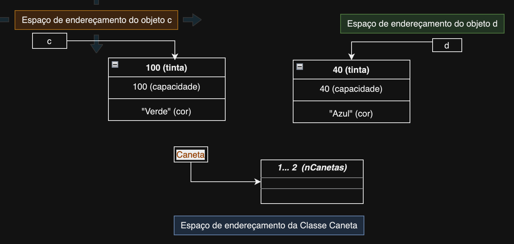

# Proteção/Acesso

## Static

Um atributo `static` é um atributo que não é privado para cada objeto, pois está associado à classe e não ao objeto.

`ex:` 
```java 
	private static int nCanetas;  	// conta quantas instâncias da classe
	 								// caneta existem
```

> Apesar do atributo não ser public, ele é partilhado por todos os objetos dessa classe.
>
> Para vermos o atributo fora da classe ele teria que ser public:

```java
	public static int nCanetas; // torna acessível à todas classes

```


Quando acedemos a um atributo de classe o ideal é acedê-lo através da classe e não do objeto:

> Em vez de `c.nCanetas`, usamos ***`Caneta.nCanetas`***;

### Métodos Static

`Métodos não estáticos` são sempre executados no contexto dum objeto (se ele existir), acedendo assim aos seus atributos.

`Métodos estáticos` são sempre executados no contexto duma classe, acedendo a atributos estáticos dessa classe ou de outras apenas. Não pode ser executado no contexto de objeto, mas sim de classe.

`ex:`  

```java 
	Caneta c;
	int x = Caneta.obtemNCanetas();
	public static int obtemNCanetas(){
		return nCanetas;
	}
```

Consideremos o pedaço de código abaixo:
```java
	Caneta c = new Caneta(100, "verde");
	Caneta d = new Caneta(40, "azul");
```

No espaço de endereçamento de memória temos algo parecido com:


> Isso mostra que os atributos estáticos (neste caso o `nCanetas`) não estão atribuídos aos objetos, mas sim às classes.



# This

É usado para referenciar a instância da classe que está a ser tratada.

```java
	public Caneta maior(Caneta c){
		if (tinta > c.tinta)
			return this;   // this referencia este objeto
		else
			return c;
	}
```

> Não pode ser usado em metodos static pois são `implementados sobre o objeto` e não no contexto de classe.

	

